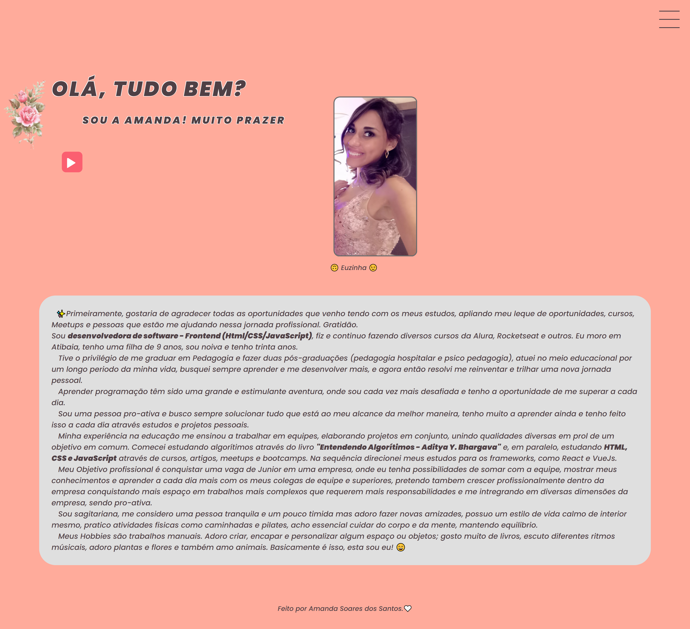

# Meu Portfólio

Este é meu portfólio em desenvolvimento, vou sempre atualizar ele conforme meus novos projetos vão ficando prontos.
 
 

| :placard: Vitrine.Dev |     |
| -------------  | --- |
| :sparkles: Nome        | **Meu Portifólio**
| :label: Tecnologias | JavaScript, html, css,  (tecnologias utilizadas)
| :rocket: URL         | https://amandasoaress.github.io/portfolio
| :fire: Desafio     | https://url-do-desafio.com.br

<!-- Inserir imagem com a #vitrinedev ao final do link -->

 
 

